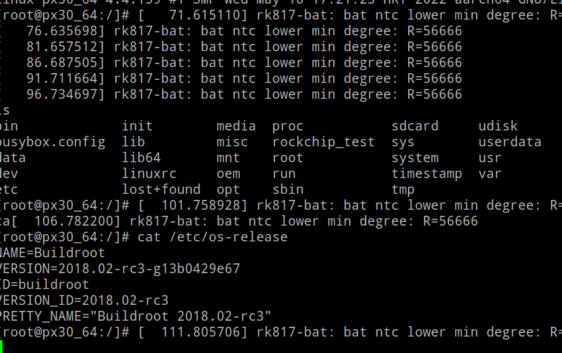
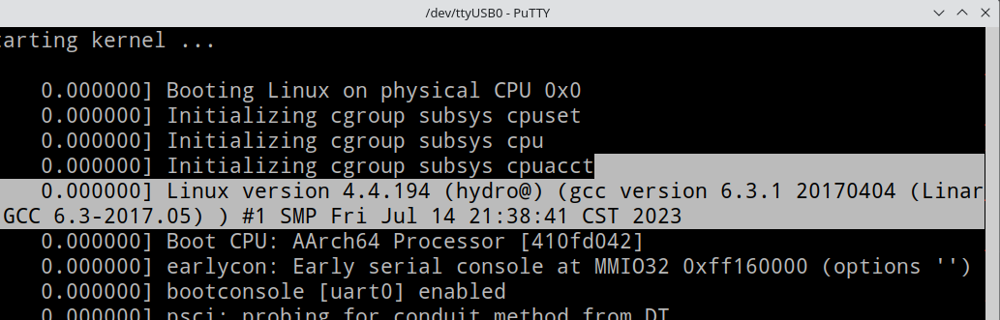

 ## README

### 前言
**这只是一篇折腾的笔记，很多不完善之处，请勿随意拿自己的词典笔进行实验，作者不对此负责，笔损坏，保修没了等等后果与作者无关**

作者因各种事情时间有限，没时间更新Doc，故开了归档

精力实在有限🫠

另外本文用了一些专有术语，但不用怕，多查查资料即可

### 串口

拆卸词典笔，焊接`TX RX焊点`

### 环境
Archlinux 2023.07 Plasma 5.27.6,linux-zen 6.4.2

笔是 **二代 YDP021**

编译依赖就不写了，建议用ubuntu or debian编译,否则你会被buildroot给折腾死，各种因为软件过新造成的Error

### 可用到的资源 Source (Thanks!)

- 常用的

​	[4.4内核 Fork from rockchip](https://github.com/hydrogenium2020-offical/ydp02x_kernel-4.4) DTB文件尚不完善,触摸，屏幕，GPIO按键不可用

[	u-boot Fork from firefly-linux](https://github.com/hydrogenium2020-offical/ydp02x_u-boot) U-Boot测试没啥Bug，进loader,maskrom没啥问题

[	Firefly PX30 Wiki](https://wiki.t-firefly.com/zh_CN/Core-PX30-JD4/) 编译方法请参考此处

​	[刷机工具,PX30芯片的SDK等等 From Firefly](https://wiki.t-firefly.com/zh_CN/Core-PX30-JD4/)

​	[Firefly Gitlab](https://gitlab.com/firefly-linux)

- 一些触摸Driver(上面的内核并没有带触摸驱动)

[	FT3427 android_kernel_lenovo_mt8167s](https://github.com/UniversalX-devs/android_kernel_unowhy_k1002-headers/commit/2a22b429a734f47ad283494fc8349bf2049d5a9f)

​	[FT3427 amlogic_linux-4.9-pie](https://github.com/LineageOS/android_kernel_amlogic_linux-4.9-pie/commit/4f75f1bd8b3203bc429f9d6178f0ebe55923a12f)

​	[cf1216](https://github.com/neggles/linux-sunxi/blob/8ea97ba1069eb825f455989da346ff55235140b9/drivers/input/touchscreen/cf11xx/sitronix_ts.c#L992)

- 串口 `Putty`[官网](https://www.chiark.greenend.org.uk/~sgtatham/putty/)

  波特率一般是`1500000`

   windows下要装瑞芯微的驱动

- [rkbin](https://github.com/rockchip-linux/rkbin) 瑞芯微提供的**一些有用的工具**，例如刷写固件的`upgrade_tool`

### 现在测试能运行的系统/固件

- buildroot Firefly官方 `PX30-LVDS-BUILDROOT-GPT-20201106-1336.img.7z` 

  - 能运行✅
  - 需要替换成官方的boot.img (使用`imgrepackerrk` `rkbin/tools/upgrade_tool`  unpack_bootimg等等)

  - 需自行编译并替换uboot.img,trust.img

  - 替换recovery.img的kernel,second部分

  - 什么能工作?

    ✅屏幕，触摸，储存

    - bug:

      触摸动不了（可能是rk给的launcher不兼容这么小的屏幕尺寸）

      adb,mtp挂载不了

      ...

- Ubuntu Firefly
  - 启动❎
  - 无论是自编译内核还是替换官方内核都不行
  - 在systemd init处panic

### 如何使用
解压并分支出sdk后，在sdk目录下执行
```bash
rm -rf u-boot kernel device/rockchip/rk3326 #删除自带的
git clone https://github.com/hydrogenium2020-offical/ydp02x_u-boot u-boot
git clone https://github.com/hydrogenium2020-offical/ydp02x_kernel kernel
git clone https://github.com/hydrogenium2020-offical/ydp02x_device_rockchip_rk3326 device/rockchip/rk3326 

#... 开始构建

```

### 折腾细节

👉[detail.md](./doc/detail.md)

## Image
  Buildroot

   

  自编译内核 Bring up

  
